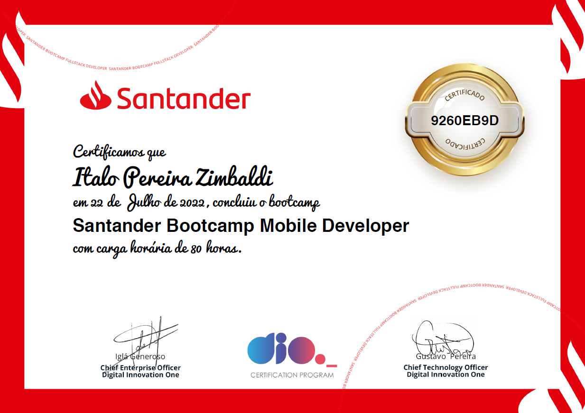
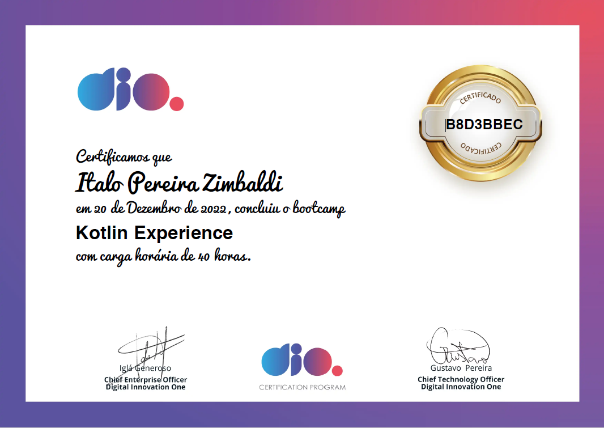

- 👋 Hi, I’m Italo @zimbaldi
- 👀 I’m interested in mobile development, 3D Printing, Raspberry Pi and related stuff
- I’m currently learning Java/Kotlin for Android and Flutter for cross platform iOS/Android
- You can reach me linkedin.com/in/italo-zimbaldi

- Mechatronic Technician - Colégio Politécnico 'Bento Quirino'
- Eletrotechnical Technician - ETEC 'Bento Quirino'
- Flutter Specialist - in Progress
- Santander Bootcamp - Mobile Development Android/Kotlin - Complete
- Kotlin Experience - Digital Innovation One - Complete

<!---
zimbaldi/zimbaldi is a ✨ special ✨ repository because its `README.md` (this file) appears on your GitHub profile.
You can click the Preview link to take a look at your changes.
--->
